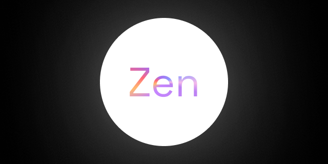

  

# Zen

Минималистичный one-finger arcade для нативных оболочек **Android / iOS** (Capacitor) и мобильного веба / GitHub Pages.

Держи палец — шар тянется к нему. Отпусти — инерция. Собирай белые орбы, уворачивайся от красных врагов. Чем дольше живёшь, тем плотнее арена и жёстче timed-events.

## Геймплей

- **Управление** — один палец: hold = притяжение, release = свободный полёт
- **Очки** — белые орбы; комбо за быстрые сборы подряд
- **Опасность** — красные враги; касание = конец раунда
- **Сложность** — каждые ~15 с растёт число врагов и темп
- **События** — случайные режимы арены (Berserk, Chain Explosion, Sniper), открываются со 2 стадии; в режиме Zen ивенты отключены

Чистый чёрный экран, без UI-шума — только шар, орбы и угрозы.

**Играть:** [decot01.github.io/Zen](https://decot01.github.io/Zen/)

**Мобильное приложение:** см. [MOBILE.md](MOBILE.md) (`npm run cap:android` / `cap:ios`).
